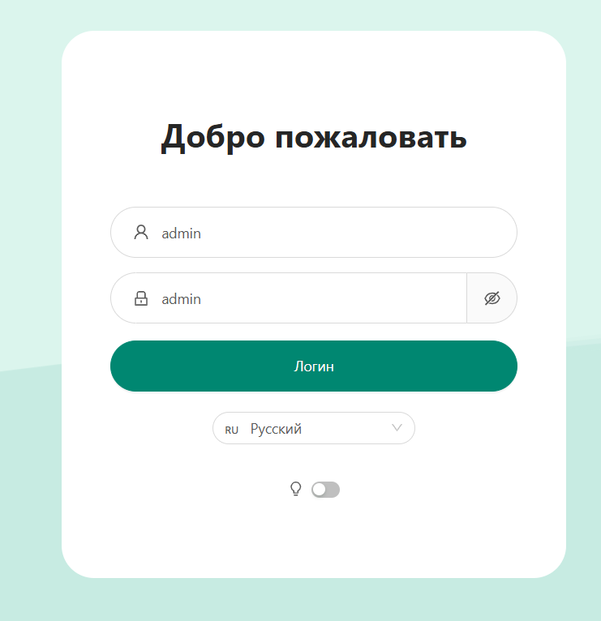
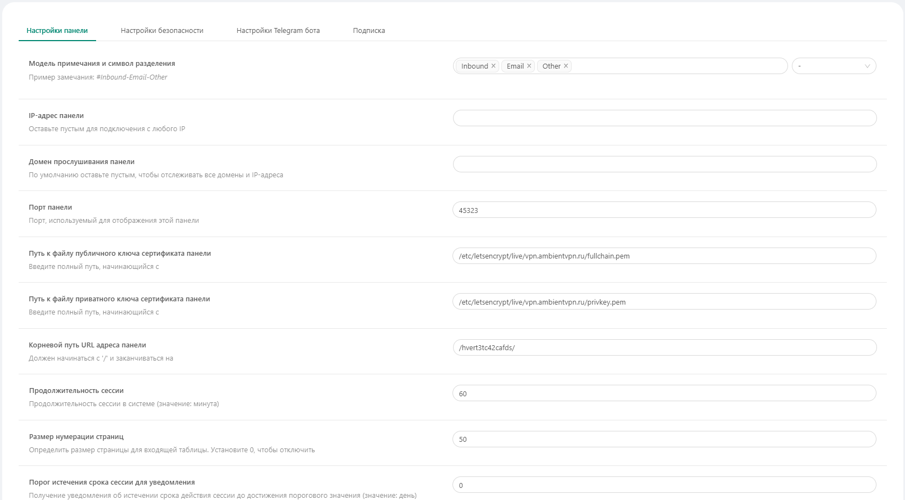
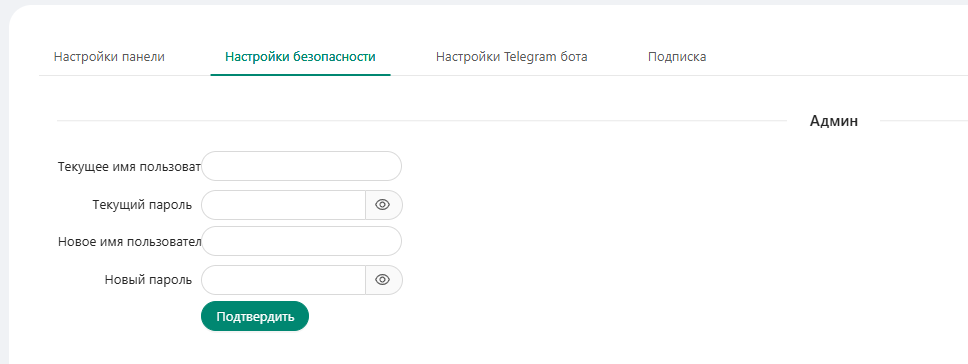
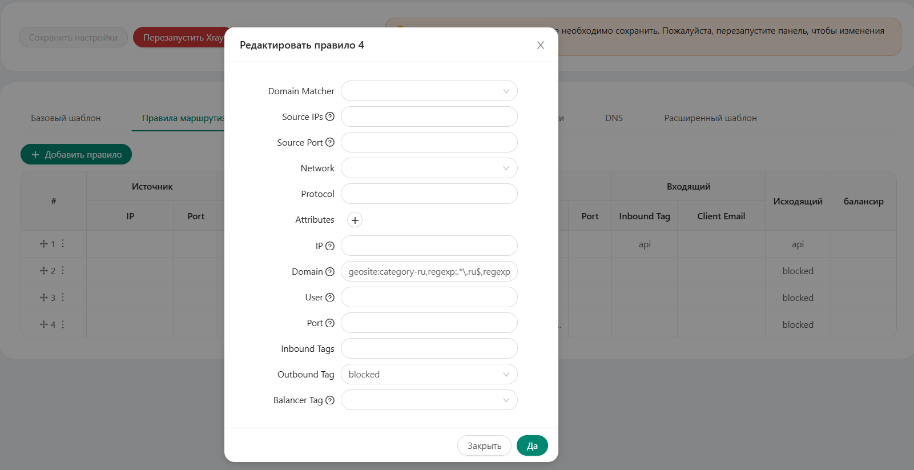
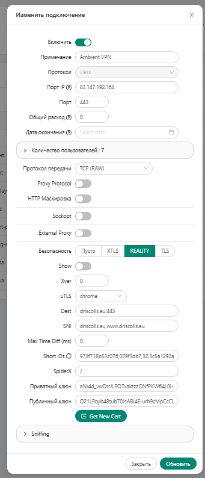
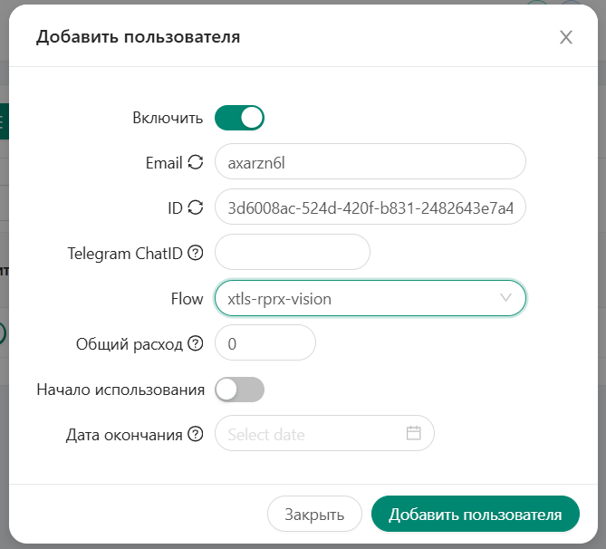

# Ambient VPN

**Ambient VPN** — прочная связка сетевых технологий для безопасного выхода в интернет.

# Содержание
- **[Технологии и инструменты](#технологии-и-инструменты)**
- **[Установка и запуск](#установка-и-запуск)**

## Технологии и инструменты

### Серверные технологии и безопасность

- **Nginx**
- **HTTPS**
- **The nginx version is disabled**

### Сетевые технологии

- **Vless**
- **Reality**
- **XTLS**
- **XRAY**

### Контейнеризация

- **Docker**
- **Docker Compose**

## Установка и запуск

### 1. Соберите docker compose:
```shell
sudo docker compose up --build
```

### 2. Получите сертификат (при первом запуске):
```
sudo docker run -it --rm \
  -v "./nginx/certbot:/var/www/certbot" \
  -v "./etc/letsencrypt:/etc/letsencrypt" \
  certbot/certbot certonly \
  --webroot \
  --webroot-path=/var/www/certbot \
  -d vpn.ambientvpn.ru\
  -d www.vpn.ambientvpn.ru\
  --email support@ambientvpn.ru \
  --agree-tos \
  --no-eff-email
```

### 3. Настройте BBR:

```bash
echo "net.core.default_qdisc=fq" >> /etc/sysctl.conf
echo "net.ipv4.tcp_congestion_control=bbr" >> /etc/sysctl.conf

sudo reboot
```

### 4. Зайдите в панель 3X-UI ```http://vpn.ambientvpn.ru:2053```:



***Подсказка:*** admin:admin

### 5. После входа в систему настройте панель. Нажмите на кнопку «Настройки панели»:

#### 5.1 Находясь в разделе «Настройки панели» нужно поменять эти параметры:

- Порт панели (По желанию, также необходимо изменить порт в файле nginx/nginx.conf)
- Путь к файлу публичного ключа сертификата панели (```/etc/letsencrypt/live/vpn.ambientvpn.ru/fullchain.pem```) 
- Путь к файлу приватного ключа сертификата панели (```/etc/letsencrypt/live/vpn.ambientvpn.ru/privkey.pem```)
- Корневой путь URL адреса панели (По желанию) 

После нажмите кнопку «Сохранить», а затем «Перезапуск панели»


***Примечание:*** Не забудьте добавить новые параметры в адресную строку.



#### 5.2 Перейдите в раздел «Настройки безопасности» и настройте эти параметры:

- Текущее имя пользователя
- Текущий пароль
- Новое имя пользователя
- Новый пароль



### 6. Нажмите на кнопку «Настройки Xray» и перейдите в раздел «Правила маршрутизации»:

Нажмите на кнопку «+ Добавить правило», после в поле «Domain» вставьте следующую строку:

```
geosite:category-ru,regexp:.*\.ru$,regexp:.*\.su$
```

Также выберите «blocked» в выпадающем списке в поле «Outbound Tag»



После нажмите кнопку «Сохранить», а затем «Перезапуск панели»

### 7. Нажмите на кнопку «Подключения» и нажмите на кнопку добавить подключение:



### 8. После настройки подключения можно создавать пользователей:



***Примечание:*** Подключиться можно через эти приложения:
- IOS - [v2RayTun](https://apps.apple.com/ru/app/v2raytun/id6476628951)
- Android - [v2RayTun](https://play.google.com/store/apps/details?id=com.v2raytun.android&hl=ru)
- Windows - [v2rayN](https://github.com/2dust/v2rayN)

